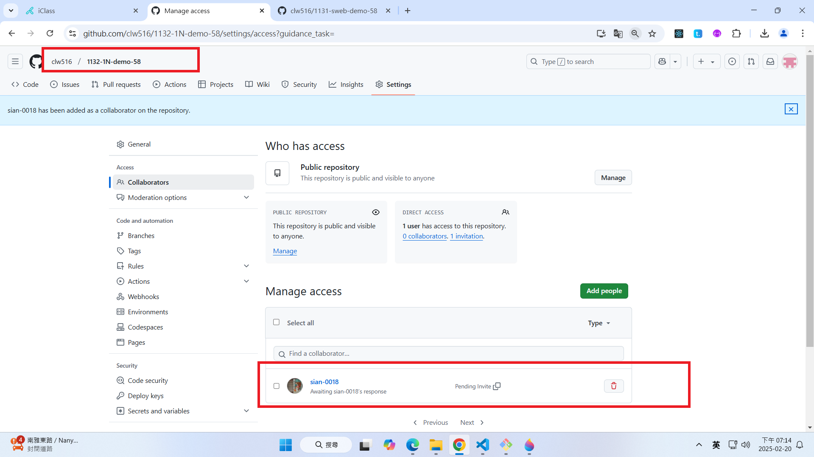
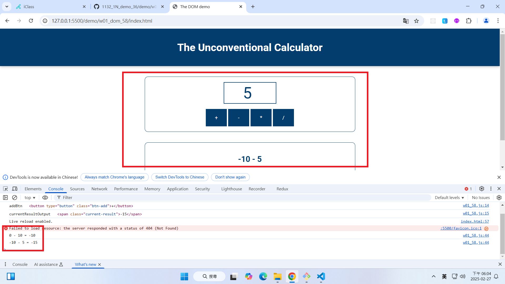
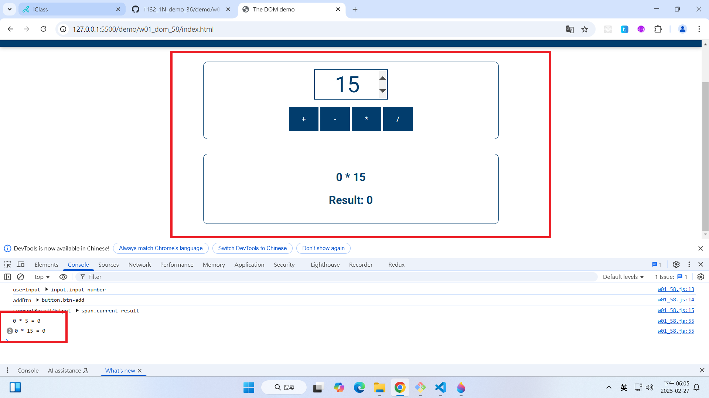

[Github URL](https://github.com/clw516/1132-1N-demo-58.git)

Video: W01-P1: Create a Github repo for 1132 semester

#### => Github repo


#### => share to teacher and TA



```
afe392b htchung Thu Feb 20 19:05:05 2025 +0800  W01-P1: Create a Github repo for 1132 semester
```

Video: W01-P2: implement add button


```
a478019 htchung Thu Feb 20 20:15:11 2025 +0800  W01-P2: implement add button
```

Video: W01-P3: implement divide button


```
bffaae4 htchung Thu Feb 20 21:01:25 2025 +0800  W01-P3: implement divide button
```

### W01-P4: implement subtract button



```

```

### W01-P5: implement multiply button



```

```
