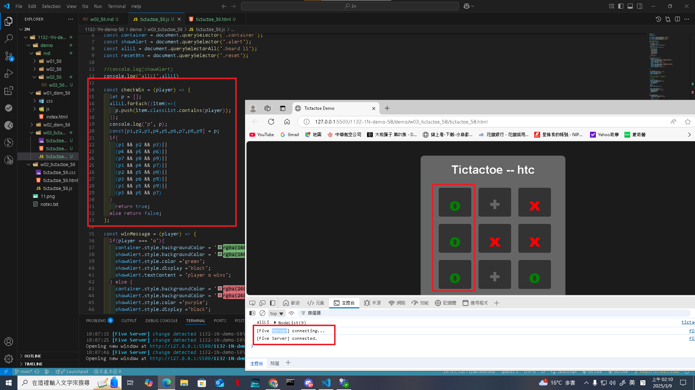
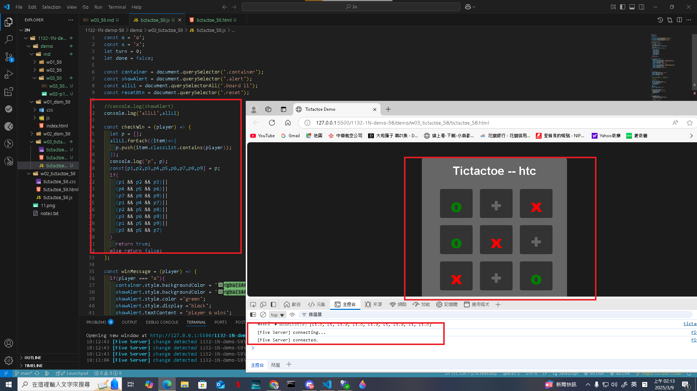
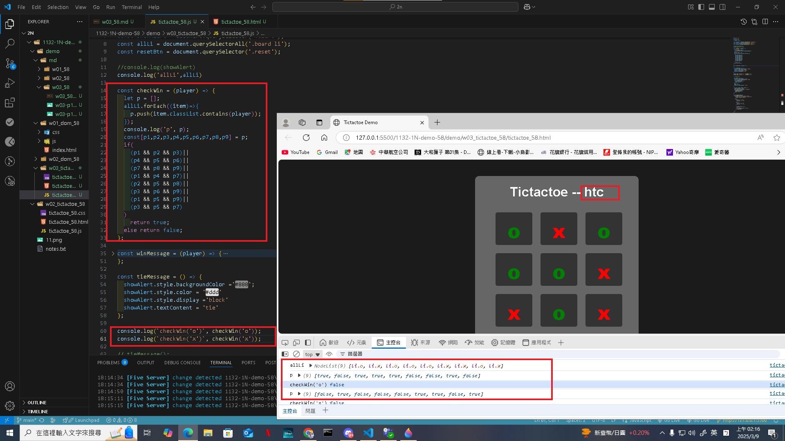
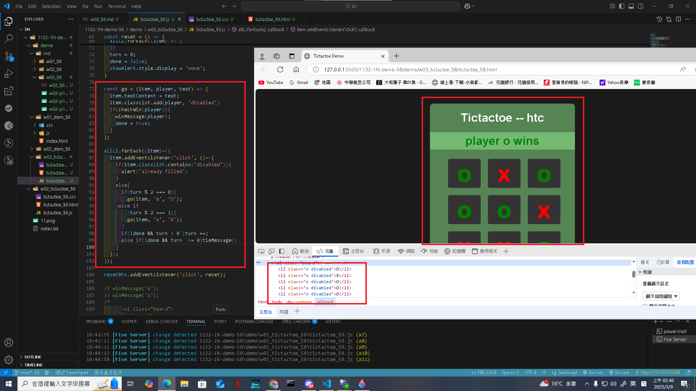
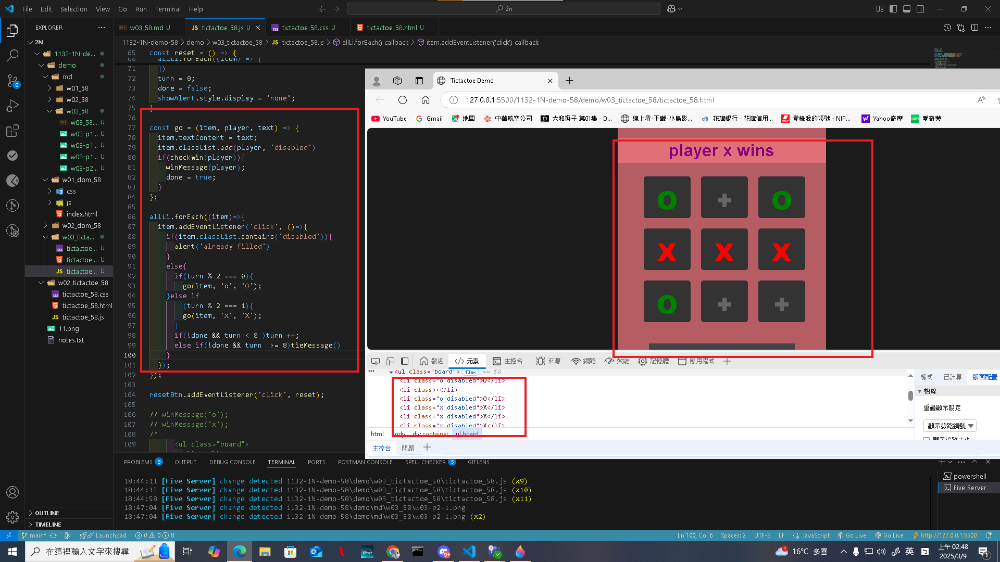
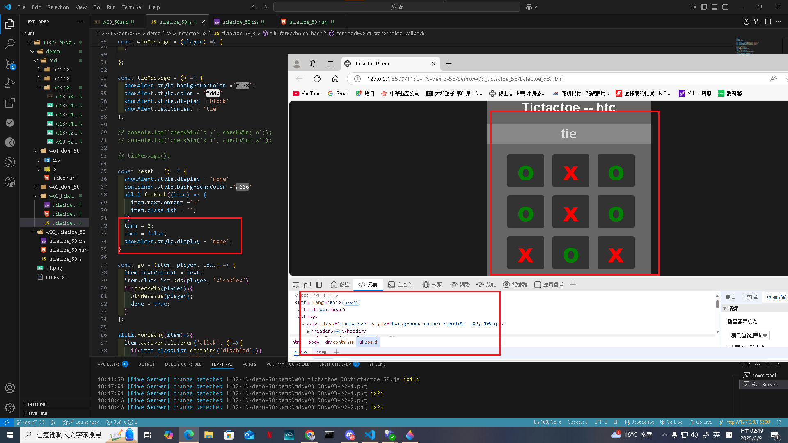
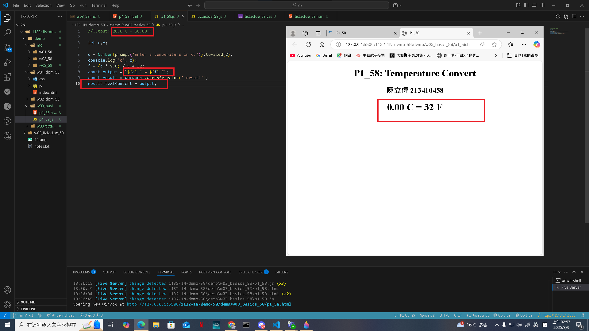

[Github URL](https://github.com/clw516/1132-1N-demo-58.git)

Video: W03-P1: Implement checkWin(player) using three different cases
 
#### => player o wins
 

 
#### => player x wins
 

 
#### => no player wins
 

 
```
fbff5c2 htchung Thu Mar 6 19:12:19 2025 +0800   W03-P1: Implement checkWin(player) using three different cases
```
Video: W03-P2: play TicTacToe successfully
 
#### => player o wins
 

 
#### => player x wins
 

 
#### => tie
 

 
```
cc1d356 htchung Thu Mar 6 20:08:15 2025 +0800   W03-P2: play TicTacToe successfully
```
Video: W03-P3: Temperature Convert from C to F
 

 
```
d2e7c01 htchung Thu Mar 6 20:59:34 2025 +0800   W03-P3: Temperature Convert from C to F
```
 
 