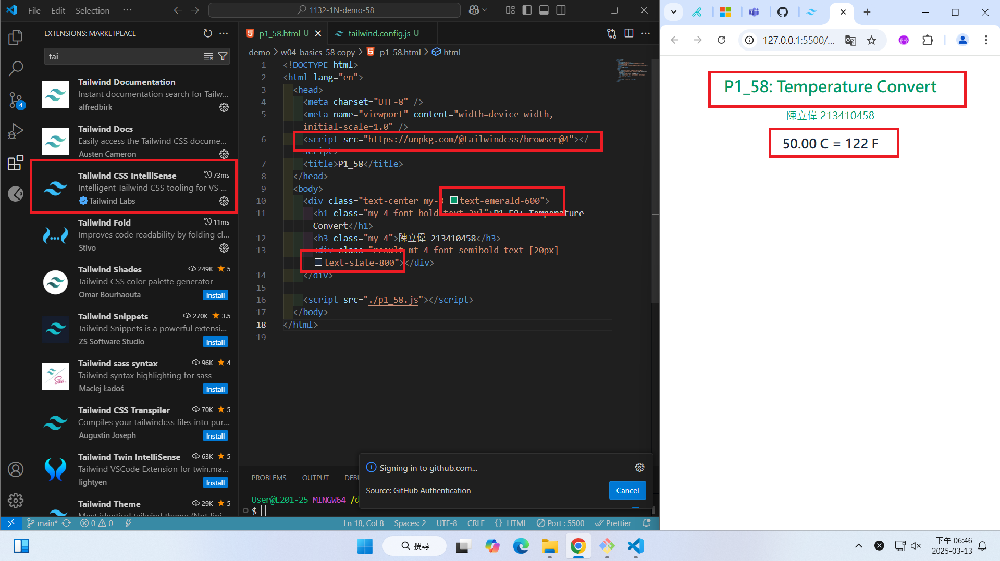
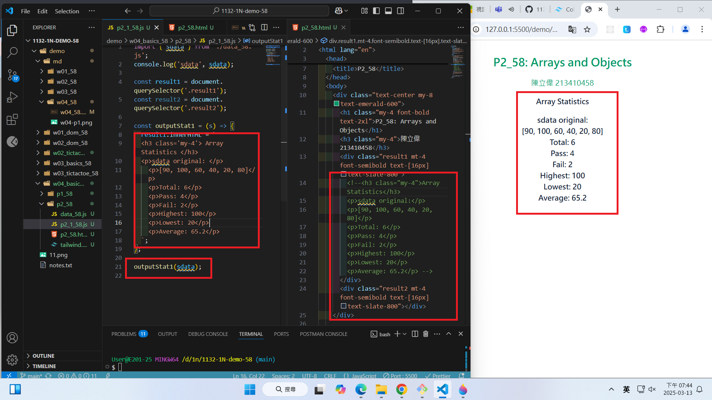
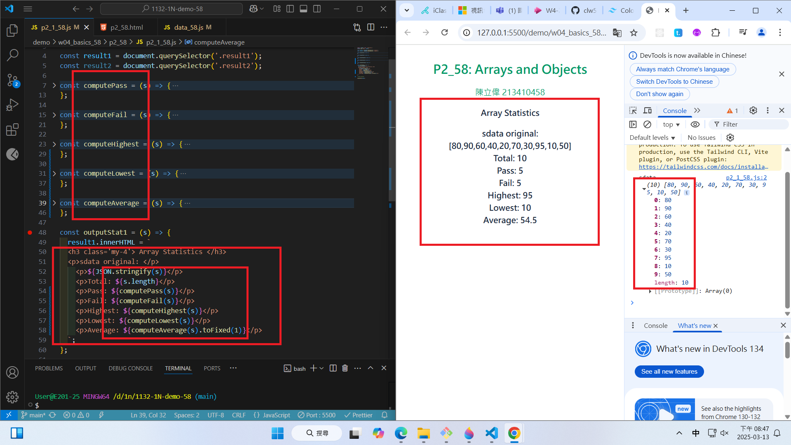
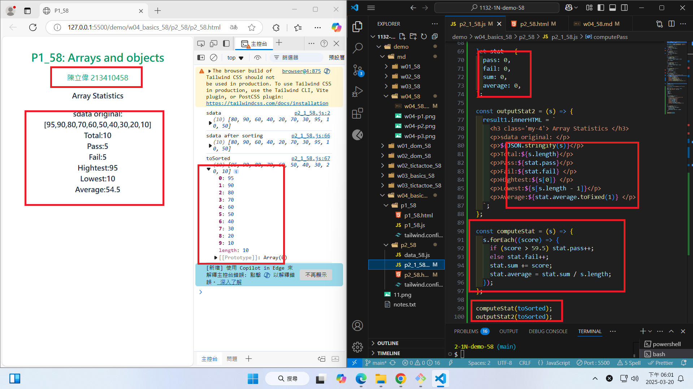

[Github URL](https://github.com/clw516/1132-1N-demo-58.git)

### Video: W04-P1: Setup tailwindcss for p1_58.html



```
084cd0c htchung Thu Mar 13 18:46:28 2025 +0800  W04-P1: Setup tailwindcss for p1_xx.html
```

Video: W04-P2: create html code to show sdata original in js code



```
76cfbf0 htchung Thu Mar 13 19:37:25 2025 +0800  W04-P2: create html code to show sdata original in js code
```

w04-p2.png

Video: W04-P3: Show sdata statistics from js code



```
776f83b htchung Thu Mar 13 20:09:49 2025 +0800  W04-P3: Show sdata statistics from js code

Video: W04-P4: Show toSorted data and a stat object to store statistical data



```

6d1f5dc htchung Thu Mar 13 20:50:55 2025 +0800 W04-P4: Show toSorted data and a stat object to store statistical data

```

```
