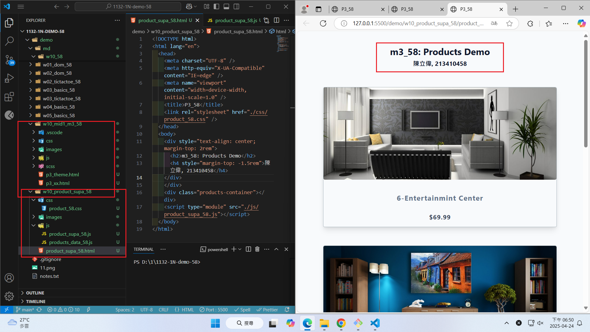
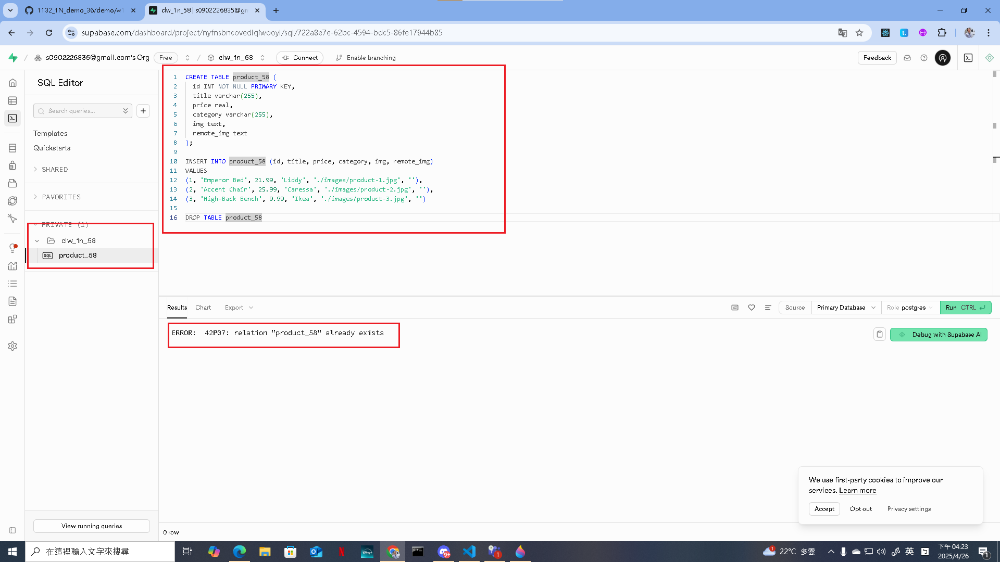
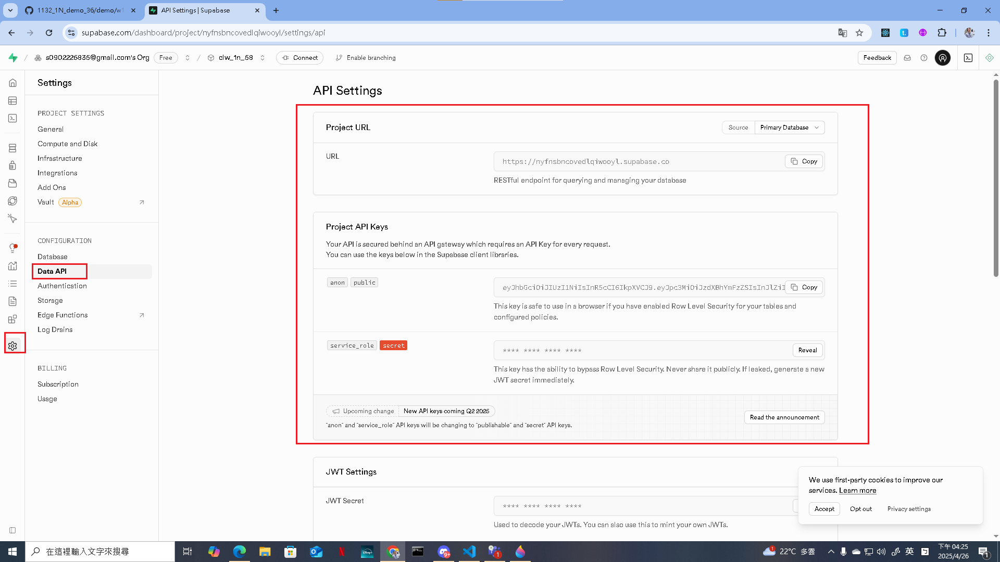
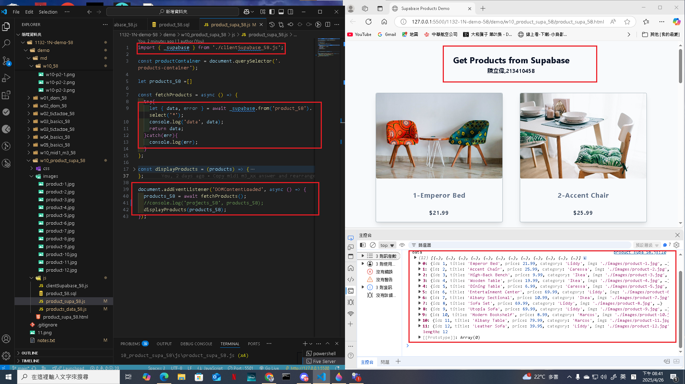
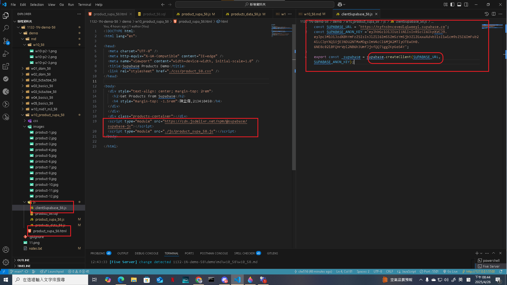

### Video: W10-P1: Copy mid1 m3_xx answer and rearrange it for W10 demo



```
ecf3412 htchung Thu Apr 24 18:39:10 2025 +0800  W10-P1: Copy mid1 m3_xx answer and rearrange it for W10 demo
```

w10-p1.png

Video: W10-P2: Setup Supabase with project yourcode_1n_58
 
#### => show product_xx table with 3 data
 

 
#### => show SQL to create product_xx table and insert three data
 

 
#### => show Project URL and ANON KEY for this project
 

 
```
834ba00 htchung Thu Apr 24 19:26:10 2025 +0800  W10-P2: Setup Supabase with project yourcode_1n_58
```

Video: W10-P3: Get 12 products from Supabase
 
#### => show how to fetch products from Supabase
 

 
#### => Show how to get supabase-js to create supabase client
 

 
```
a090b22 htchung Thu Apr 24 20:11:20 2025 +0800  W10-P3: Get 12 products from Supabase
```