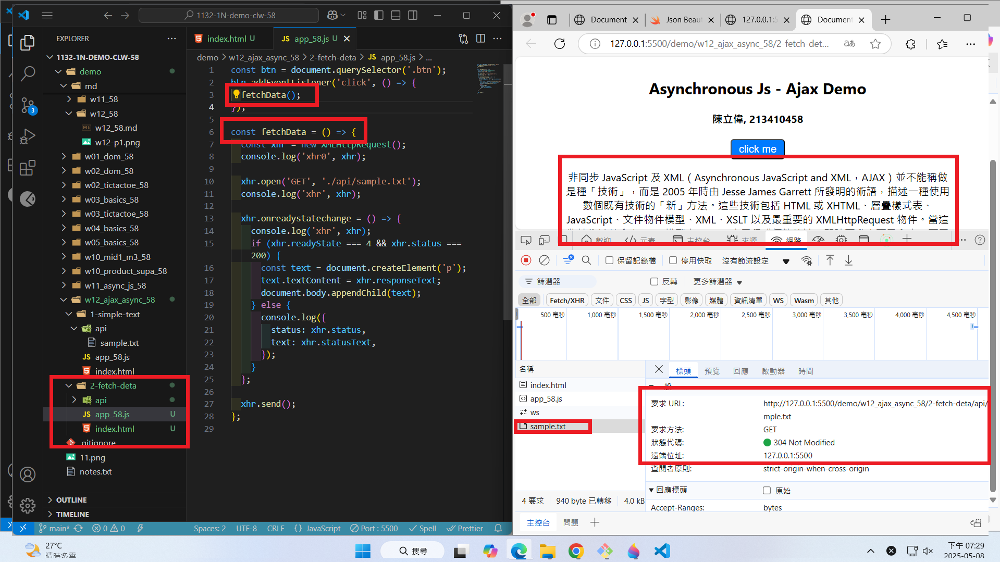
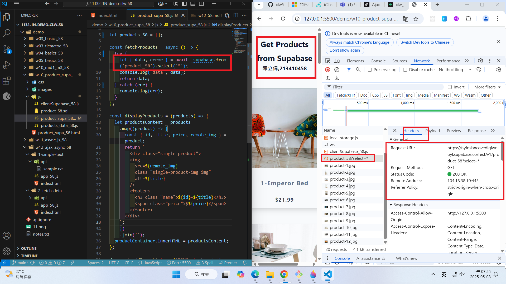
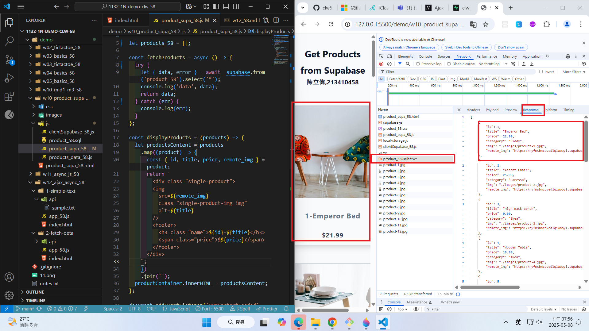
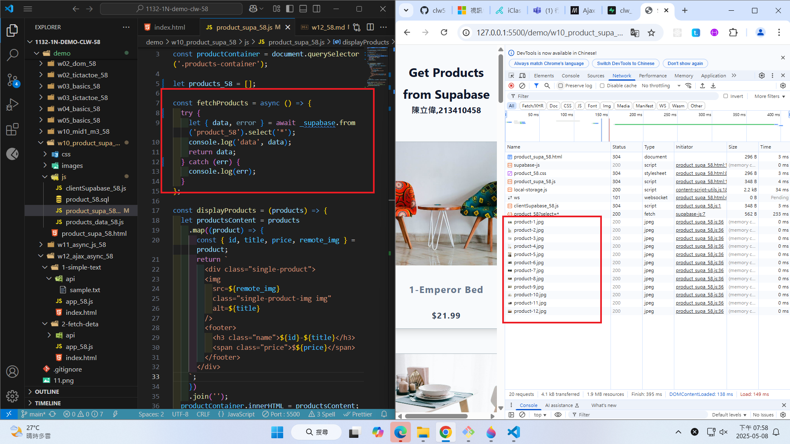

### Video: W12-P1: use xhr to display a simple text


```
7894cdb htchung Thu May 8 19:01:43 2025 +0800   W12-P1: use xhr to display a simple text
```

### Video: W12-P2: click a button to fetch data



```
7336c51 htchung Thu May 8 19:26:31 2025 +0800   W12-P2: click a button to fetch data
```

Video: W12-P3: Run w10_product_supa_xx, see how it works

#### => \_supabase.from('product_xx').select('\*');



#### => check response



#### => check how many http requests being done in fetchProducts


