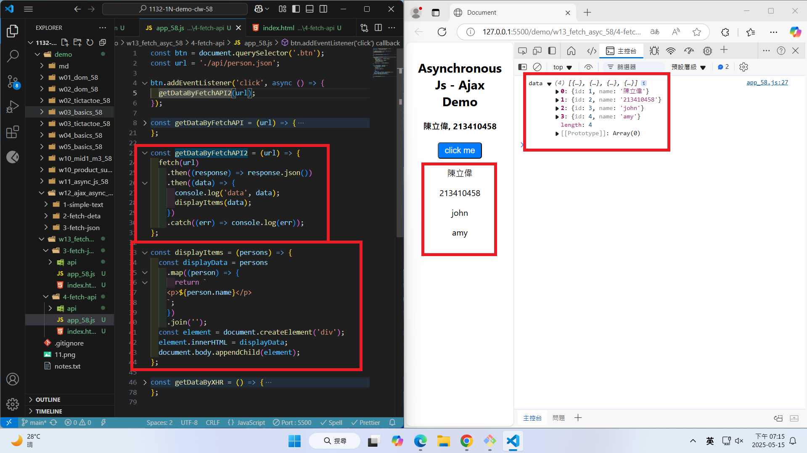
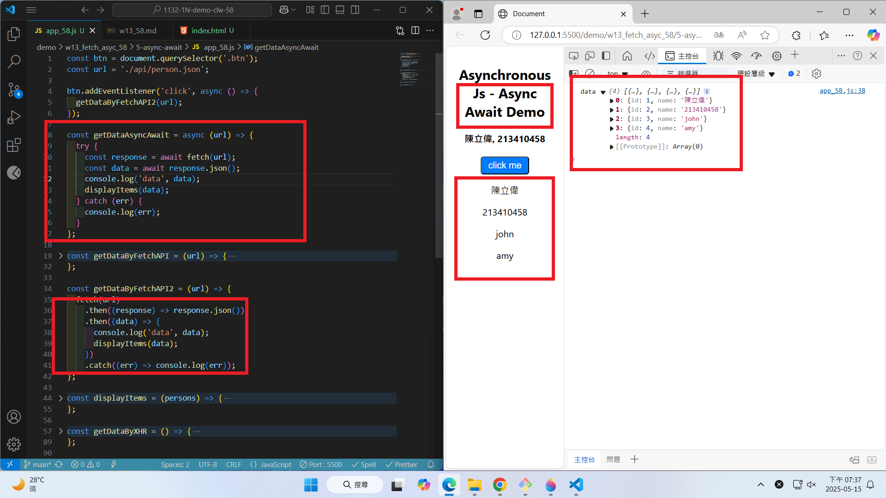
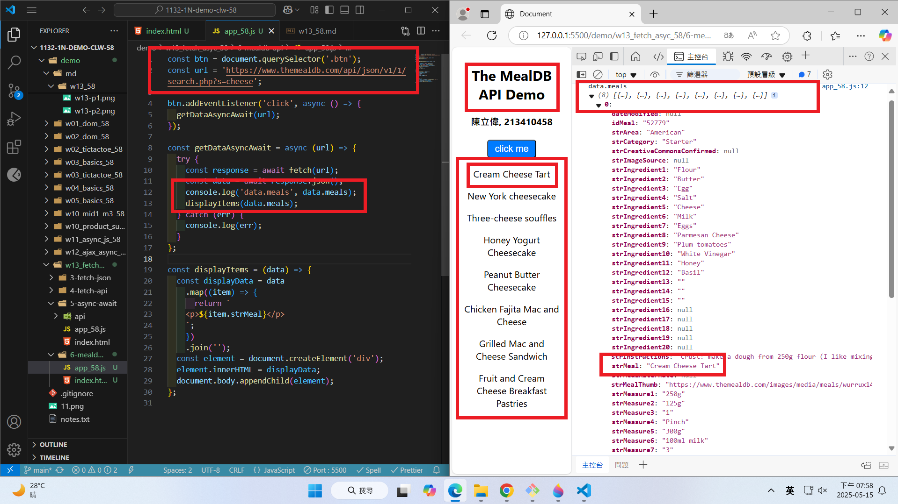
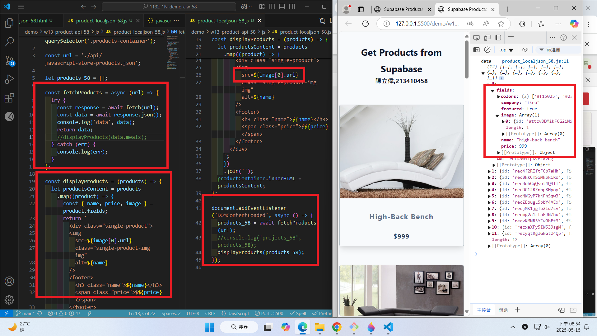
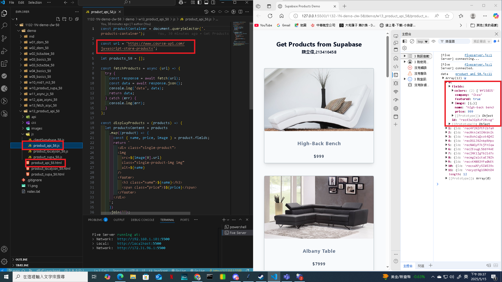

### Video: W13-P1: Use fetch API to replace xhr approach



```
b28f70b htchung Thu May 15 19:16:22 2025 +0800  W13-P1: Use fetch API to replace xhr approach

```

### Video: W13-P2: Use Async Await to replace fetch API approach



```

1d45c2f htchung Thu May 15 19:38:52 2025 +0800 W13-P2: Use Async Await to replace fetch API approach

```

``

### Video: W13-P3: Get meals about cheese from TheMealDB




601a109 htchung Thu May 15 20:02:17 2025 +0800  W13-P3: Get meals about cheese from TheMealDB
```

```


### Video: W13-P4: Get Products from local json and from API

#### => Get products from local json



#### => Get products from API



```
91ef277 htchung Thu May 15 20:59:42 2025 +0800  W13-P4: Get Products from local json and from API
```
